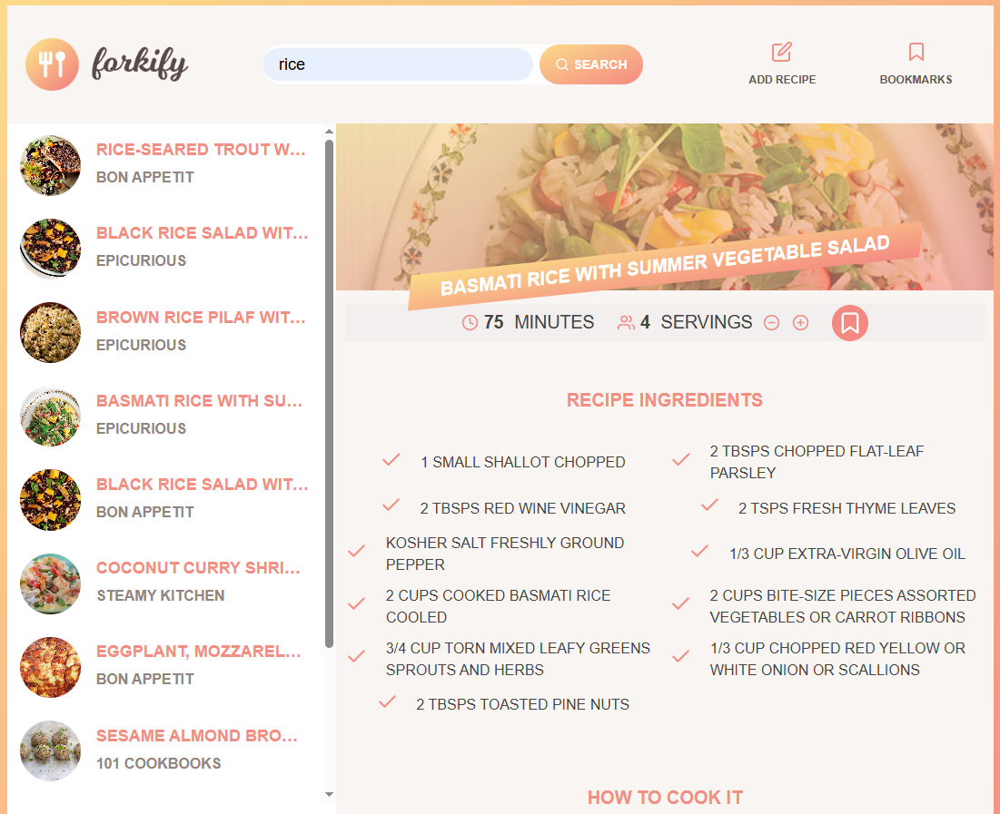
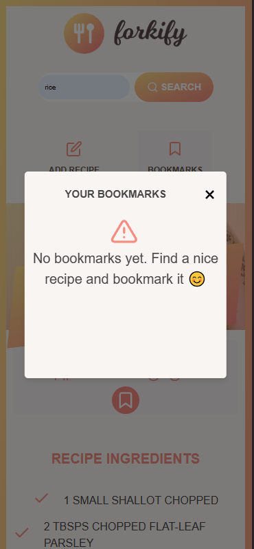

# TABLE OF CONTENTS 

[Project Title](#project-title)
[Description](#description)
[Forkify Typescript Project](#forkify-typescript-project)
[Snapshots](#snapshots)
[Github Deployed][#github-deployed]
[Github](#github)
[Contact Us](#questions)
[Licence](#licence)

## Project Title

Forkify Recipe Application

## Description

This project was part of learning advanced Javascript: The Complete Javascript Course 2025: From Zero to Expert with Jonas Schmedtmann. 

## Forkify TypeScript Project

This is a modern, TypeScript-based implementation of the Forkify recipe app, inspired by Jonas Schmedtmann’s original JavaScript project. The application allows users to search for recipes, view detailed instructions, bookmark favorites, and manage servings-all with a responsive UI and robust state management.

### Key Differences from Jonas’s Implementation

- **Architecture & Event Handling**  
  - **This project:** Uses an abstract class and the Observer pattern for event handling. Controllers (like `UIController` and `RecipeController`) publish and subscribe to events, which decouples the UI from business logic and improves scalability.
  - **Jonas’s project:** Passes controller functions as callbacks directly to view methods (e.g., `recipeView.addHandlerRender(controlRecipe)`), which tightly couples views to specific controllers.

- **Separation of Concerns**  
  - **This project:** Features dedicated controllers for UI and recipes, resulting in clearer, more maintainable code.
  - **Jonas’s project:** Combines most logic in a single controller.

- **TypeScript & Modern Tooling**  
  - **This project:** Written in TypeScript, providing static type checking and better editor support. Uses modern Webpack features for asset management, cache busting, and automated deployment with the `gh-pages` package.
  - **Jonas’s project:** Written in vanilla JavaScript with simpler build and deployment processes.

---

**In summary:**  
This Forkify implementation is architected for maintainability and scalability, using modern TypeScript patterns and a more decoupled, observer-based approach to event handling, compared to the callback-based structure of the original tutorial.

## Snapshots

## Github Deployed

[Github Link](https://sho-ayb.github.io/forkify-recipe-app-jonas/)

## Github

[Github Profile](https://github.com/Sho-ayb)

## Questions

sho.ayb@outlook.com

## Licence

MIT License

Please click on the badge for more details on the licence.

